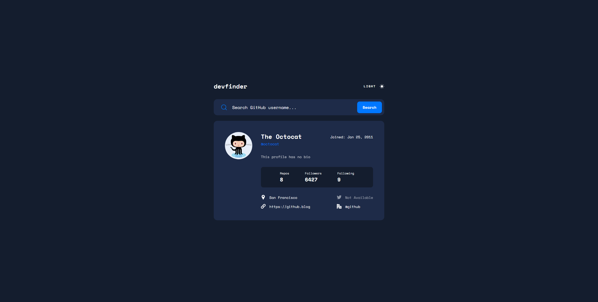

# Frontend Mentor - GitHub user search app solution

This is a solution to the [GitHub user search app challenge on Frontend Mentor](https://www.frontendmentor.io/challenges/github-user-search-app-Q09YOgaH6). Frontend Mentor challenges help you improve your coding skills by building realistic projects.

## Table of contents

- [Overview](#overview)
  - [The challenge](#the-challenge)
  - [Screenshot](#screenshot)
  - [Links](#links)
- [My process](#my-process)
  - [Built with](#built-with)
  - [Useful resources](#useful-resources)
- [Author](#author)

## Overview

### The challenge

Users should be able to:

- View the optimal layout for the app depending on their device's screen size
- See hover states for all interactive elements on the page
- Search for GitHub users by their username
- See relevant user information based on their search
- Switch between light and dark themes
- **Bonus**: Have the correct color scheme chosen for them based on their computer preferences. _Hint_: Research `prefers-color-scheme` in CSS.

### Screenshot

### Links

- Solution URL: [GitHub](https://github.com/AceDub/github-user-search-app)
- Live Site URL: [https://acedub.github.io/github-user-search-app/](https://acedub.github.io/github-user-search-app/)

## My process

### Built with

- Semantic HTML5 markup
- CSS custom properties
- Flexbox
- Mobile-first workflow
- Sass

### Useful resources

- [prefers-color-scheme](https://piccalil.li/tutorial/create-a-user-controlled-dark-or-light-mode/) - I used this layout for the light/dark mode. (If using single quotes in JavaScript, update the regex in getCSSCustomProp to include single quotes)
- [Day.js](https://day.js.org/) - An easy way to convert the date to your preferred format

## Author

- Frontend Mentor - [@AceDub](https://www.frontendmentor.io/profile/AceDub)
- GitHub - [@AceDub](https://github.com/AceDub)
